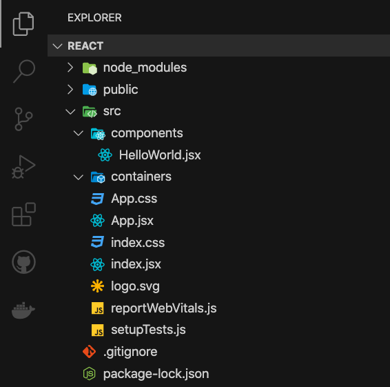
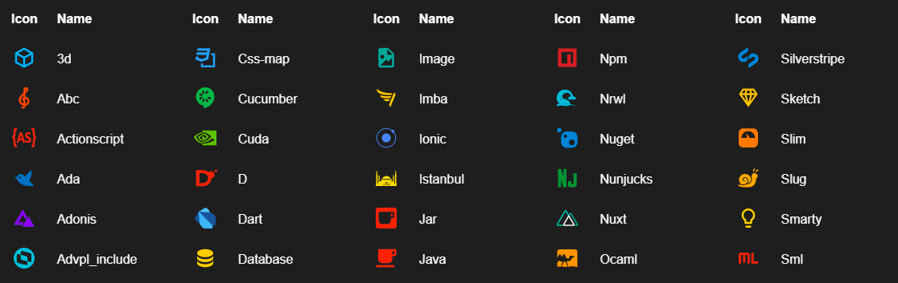
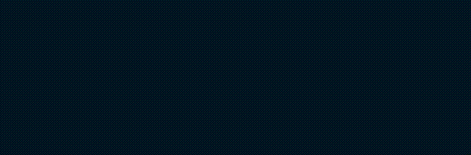

# CodeSandbox Black


Note: The font stack used is

```yaml
MonoLisa, Menlo, Monaco, 'Courier New', monospace
```

## Preview



&nbsp;

## Icons



Get Material Icons here [Material Icon Theme](https://marketplace.visualstudio.com/items?itemName=PKief.material-icon-theme)

&nbsp;

## Fonts



Get MonoLisa fonts here [MonoLisa](https://www.monolisa.dev/)

&nbsp;

## Terminal


Get Oh My Zsh for your terminal here [Oh My Zsh!](https://ohmyz.sh/)
